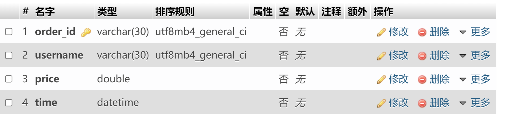

# homework

## 第一次作业

我觉得的我之前学的太烂，缺少实践忘了很多就没加啥新东西（其实是光搞旧的就快嗝屁了）
这次主要就是在调元素的位置还有做水平导航栏（还是很简陋），然后在移动端还时显示错位。
  要查看就点击这个[链接](https://kierinter.github.io/homework/%E6%88%91%E7%9A%84%E5%AE%B6%E4%B9%A1/index.html)  
## 第二次作业

我懒得排版就把卷子写成markdown了，在[这个网页](https://kierinter.github.io/homework/第二次作业/复试试卷)打开。然后[前后端理解](https://kierinter.github.io/homework/第二次作业/前后端的理解)在这   
我等会学着搞个博客吧，周四前应该能搞定。 
看我写的这么累部长们给个star呗😉😏

## 第三次作业

我没用porcasson ，用的语雀文档在[这里](https://www.yuque.com/docs/share/34fb1cf4-599e-4495-ae48-63c81c5aa6ce)

## 第四次作业

九九乘法表很快就搞定了

## 考核

我发现我php看得太少了，然后谷歌一搜发现都说是与MySQL结合的，于是光想着用数据库写了，然后就一直没找到方法能按要求的数据的方法。
最后试着搜了“PHP在文件中实现模糊查询的方法”，找到了一条纯PHP的路。  
我把数据库的也放了上来，应该有很多错误。

## 第五次作业

搞了好久算是把增删改查过了一道。
用PHP导出sql我查到的就脚本和phpmyadmin两种方法。我要去先去赶作业，就先用phpmyadmin直接导出吧。以后补上。

## 第六次作业

我看到好多地方都要用到正则，我就去学了，现在大概是看着表能写出来了。

我重写了一下php的模糊搜索。还在第六次作业的文件夹下。命名为search-2nd.php.  
这里我要感谢StackOverflow的大佬给与我的支持.

## 第七次作业

因为这里的改和删都是需要用户id的，我就加了一个通过用户名查询id的接口。这也提醒我在增的时候加了个查重功能。
## 第八次作业已上交

## 第九次作业

这次我设置了两个表，一个存储绑定绑定学生的信息，另一个储存拾卡的信息，通过学号将两者联系起来。我搜索支护发现要完美解决这个还要用到cookie，
不过还是先这样吧，等有时间再优化。😕🙃🐶😩

## 第二次考核

先交前三个

## php面向对象实例
简单写了一下php面向对象里的类的继承、多态、权限控制符、访问方法。

## laravel第一次作业已交

附上接口截图

## mvc理解已交

[这里](https://www.yuque.com/haoluo/notes/iscfnx)是语雀的文档

## sql文件已交

完成的截图git训练的截图:
.png)

数据集表的截图:
主键均为生成的订单号与商品id

## 第十一次作业已完成

由于种种外部原因还有个人水平不足导致作业迟交了很久

这个是使用jwt登录验证成功的截图

除了简单的登录验证，我还完善了下CRUD系统，学习了些rest api 的知识

后两次作业本周应该能搞定
