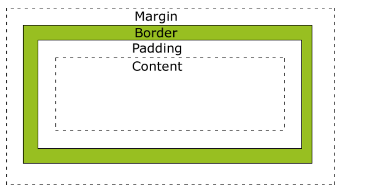

# 2021三翼工作室技术部复试试题
                    考试时间：60分钟     满分：120分
## 一、填空题（20分）
1. html指的是___________超文本标记语言____________
2. 在css中用一行代码（任意一种）将所调用的div隐藏: visibility:hidden
3. 在元素的上方设置10像素的内边距:padding-top:10px;
在元素的左方设置10像素的外边距:margin-left:10px;
4. 文本编辑器是程序员不可分开的工具，比如有Vscode,Vim,dev-C++,codeblock
5. 请将各标签与其对应的功能相连接
    标题标签  \<h1>	
    强调文本 \<strong>	
    换行\<br>
    超链接标签\<a>
    段落标签\<p>
    斜体\<em>
    表格\<table>
    水平分割线\<hr>
    定义预格式文本\<pre>

## 选择题（30分）（除标注外事2分）

1. 下列元素中，不属于块级元素的是 ( B)
```html	
A.<h1>B.C.<ul>D.<p>
```

1. 下列引用外部样式表style.css的语句中，正确的是 (  D )

```html
A.<link src=”style.css” type=”text/css” />
B.<link href=”style.css” type=”css” />
C.<link src=”style.css” type=”text/css” rel=”stylesheet”/>
D.<link href=”style.css” type=”text/css” rel=”stylesheet” />
```

3. 下面HTML中，哪个可以添加背景颜色？  （  A）

```html
<body color="red">
<background>red</background>
<body bgcolor="red">
<body style="background-color: red">
```

4. 如何制作电子邮件链接？ （   A  ）

```html
<a href="jishubu@sky31.com">
<mail href="jishubu@sky31.com">
<a href="mailto: jishubu@sky31.com">
<a src="jishubu@sky31.com">
```
5.Morii想定义一个无序列表，以下为他所写四种代码，其中正确的是 (    )
```html
A.<ol><li>三翼</li></ol>
B.<ul><ol>三翼</ol></ul>
C.<ul><li>三翼</li></ul>
D.<ol><ul>三翼</ul></ol>
```
6. 样式定义如下：

```
#p1{background-color: red; margin: 200px 100px 20px 50px;}
#p2{margin-top: 20px;}

<div id="p1">text A</div>
<div id="p2" >text B</div>
```
那么text A 和text B之间相距像素为 (    )（3分）
A.20px    B.220px             C.100px           D.40px
1. class是设置标签的（  ），id是设置标签的（  ）
A.标识     B.选择类  C.选择器   D.类 
8. 请看如下代码:
```html
	<div id=”demo”>
		<a href=”sky31.html”>进入</a>
	</div>
	<p>
		<a href=”back.html”>上一步</a>
		<a href=”next.html”>下一步</a>
	</p>
```
现若需要实现：当鼠标点击“进入”这一链接时，文本“进入”的字体变成红色，其他链接不变。下列样式定义中，正确的是 (  D  )（3分）
```css
A.	a:active {color:red;}
B.	.demo a:hover{color:red;}
C.	#demo a:hover{color:red;}
D.	#demo a:active{color:red;}
```
9. 请看如下代码:
```html
<div style="float:left;">text A</div>
<p style="clear:left;">text B</P>
```
此代码在页面上的显示效果为 ( A  )
A.	text A和text B分两行显示，且文本左对齐
B.	text A和text B在一行显示，且文本左对齐
C.	text A和text B分两行显示，且文本右对齐
D.	text A和text B在一行显示，且文本右对齐
10. 以下能够在css中获取网页中的第3个div的是 ( C  )（3分）
A.div:3th-child                     
B.div:2th-child
C.div:nth-child(3)                   
D.div:nth-child(2)
<!-- 考察css3里的:nth-child()选择器,用以选中父元素下特定的元素;n还可以为公式
:nth-child指明第几个子元素,排序与:前无关. -->
11. 查看如下样式定义:
  ```
  .A .B{font-weight:bold;}
  #C{font-weight:bold;}
  ```
下列选项中，sky31加粗显示的是 ( D)（3分）
```html
A.<a class=”A”>sky31</a>
B.<a class=”C”>sky31</a>
C.<p id=”A”><a id=”B”>sky31</a></p>
D.<p class=”A”><a class=”B”>sky31</a></p>
```

1.  以下关于盒子模型描述正确的是（ c ）（4分）
A.	标准盒子模型中：盒子的总宽度 = 左右margin + 左右border + 左右padding   + width
B.	IE盒子模型中：盒子总宽度 = 左右margin + 左右border +width
C.	标准盒子模型中：盒子的总宽度 = 左右margin + 左右border +width
D.	IE盒子模型中：盒子的总宽度 = width
<!-- IE盒子里总宽度为左右boder+左右padding+width -->
## 三、简答题（40分）
#### 编写出一个网页可能需要哪几种语言？（2分）
HTML,Javascript,CSS
#### 请画出css盒子模型(5分)

#### 实际问题
 
##### 一. 现需制作一张网页，里面包括一个id为content的div中正中间显示任意三个技术部部长级成员的名字，并在这个div的右上角放置一张logo.jpg的图片。要求这个div宽为1500像素，高度为300像素，上下内边距为50像素，边框的磅值为2像素，实线，颜色为黑色，在整个页面中水平居中。文本要求大小为20像素，字体颜色为#eeeeee，文本在div中需要水平垂直居中。图片logo.jpg与此html文件在同一文件夹下，宽为100像素，高为200像素。css文件名为style.css与html文件在同一文件夹,用外联方式引入css文件。请写出这个网页的具体代码。（答案不唯一，实现即可，请写出html、css完整代码）（17分）

html部分：
```html
<!DOCTYPE html>
<html>
    <head>
        <meta charset="utf-8">
        <link rel="stylesheet" tpye="text\css" href="style.css" >
    </head>
    <body>
        
        <div id="content">
            名字1 名字2 名字3
        </div>
    </body>
```

css部分:
```css
#content
{width:1500px;
height:300px;
pading:50px 0;
border:2px solid black;
text-align:content;
font-size:20px;
color:#eeeeee;
position:relative;
top:-605px;}
img
{position:relative;
top:-604px;}
```

我把这个也传了上来[链接]().

##### 二.嘉瑞哥哥之前接到了一个项目，具体是利用了一个焦点滚动图的插件来制作，但是在内测过程中发现因为其中照片太多但是该插件又是需要缓存全部图片以后才能顺利出现，其中有一段等待的空白期，用户体验极差，你有什么办法提高用户体验呢？对于这个反面教材你有什么启示呢？

办法:   
    1. 压缩图片
    2. 将图片分散到几个文件夹中?  

启示:
    1. 从实际出发


##### 随便例举几个HTTP的响应码以及意思（5分）
   1. 404:服务器无法找到被请求的页面
 <!--不存在的网页.jpg-->
   2. 503:服务器不可用
   3. 502:服务器充当网关或者代理的角色时,从上游服务器收到一个无效的反映
   4. 403:请求页面的访问被禁止. 


## 四、附加题（30分）

1. 至少写出linux操作系统下的五个基本命令，越多越好。（5分）
   1. shutdown -h now 关机
   2. reboot 重启
   3. cd / 切换
   4. rm -rf /* 删库跑路
   5. touch 新增文件

2. 简单描述下你认为的接口(6分)
    1. 接口是前后端分离的产物,用以提高工作效率, 减少沟通障碍.
    2. web中的接口是前端与后端进行数据交互的统称, 也叫做数据接口. 为确保前后端的协作沟通.
    3. 一般由前端和后端一起来定义接口的规范, 规范的内容一般包含接口的地址, 接口的输入参数和输出的数据格式(结构), 最终由后端来实现这些规范, 为前端提供符合规范的接口


3. 陈磊要进学校的教务系统查成绩，在他输入账号密码进入系统之后，**发现自己挂了两门课**<!--是不是根据真实事件改编?!-->，这个过程实现了前后端的数据交互，请简述这个过程（登录和查成绩）？（9分）
   1. 登录:
      1. 前端获取账号密码数据发给后端
      2. 后端收到数据后与数据库比较,返回登陆信息
   2. 查成绩:
      1. 前端将个人信息以及指令传输给后端
      2. 后端在数据库中获取成绩并传回前端